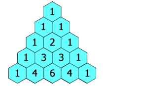

## Champagne Tower

### Technique
Row-by-row dynamic programming simulation.

### Key Idea
If a glass exceeds capacity, overflow splits equally into two glasses below.

### Complexity
Time: O(n²)
Space: O(n²)

