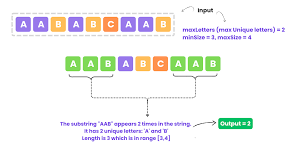

## Longest Balanced Substring (a, b, c)

### Technique
Prefix difference hashing.

### Key Insight
If two prefix states share identical (B-A, C-A),
the substring between them has A = B = C.

### Complexity
Time: O(n)
Space: O(n)

